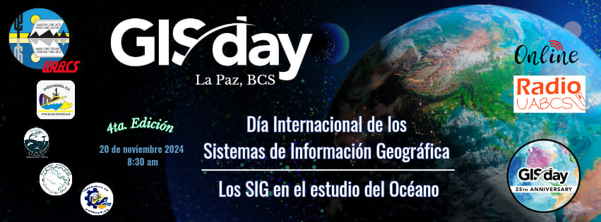
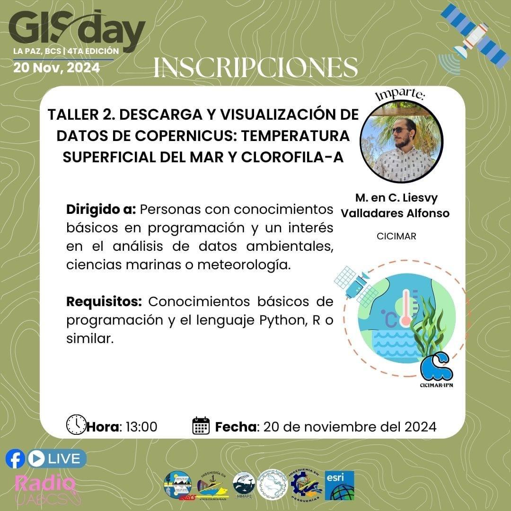

# GIS-Day-DVDC

Taller: Descarga y visualización de datos de Copernicus

## Descargar ANACONDA
https://www.anaconda.com/download/success

# CONTACTO

**Nombre:** Liesvy Valladares Alfonso
**Correo:** lvalladaresa2100@alumno.ipn.mx
